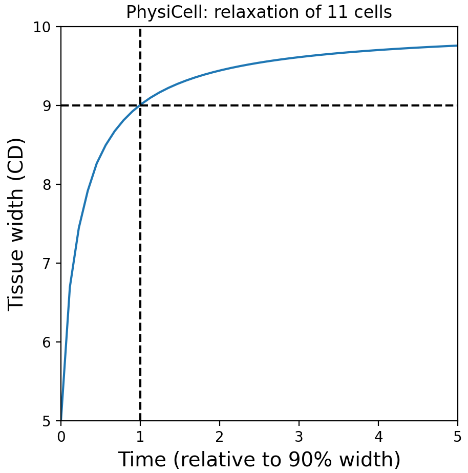
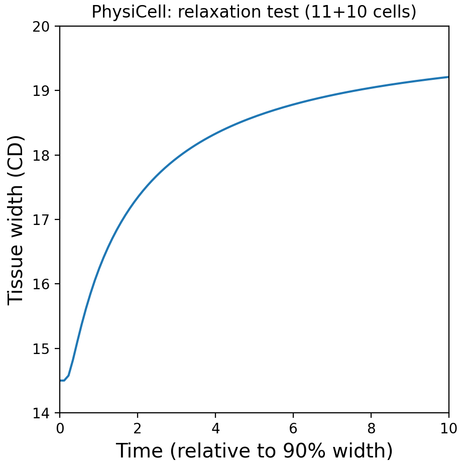
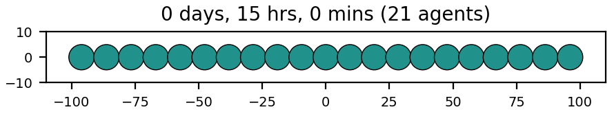
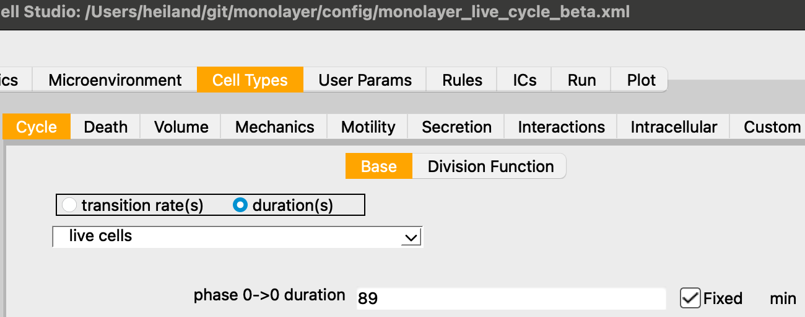
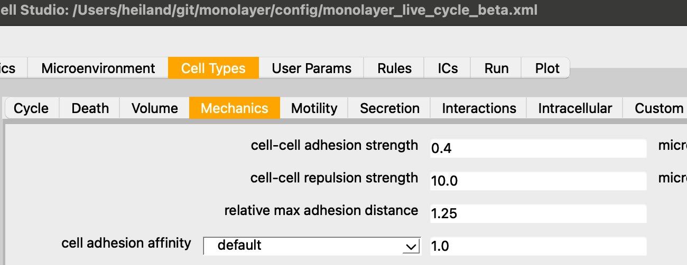
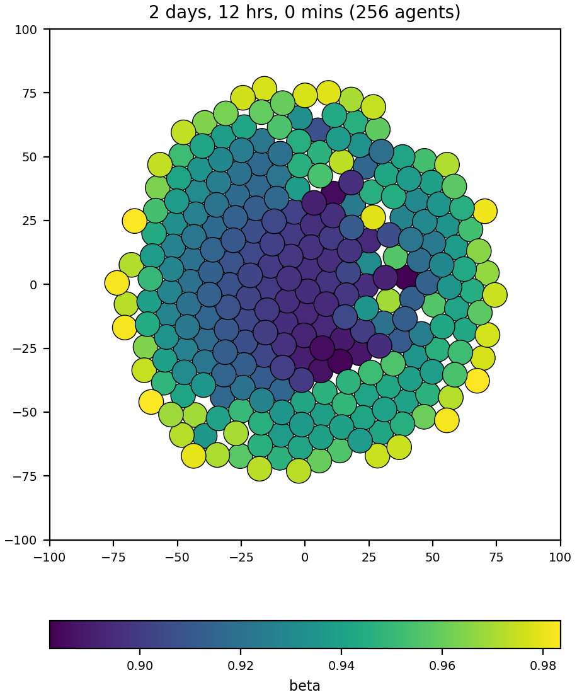
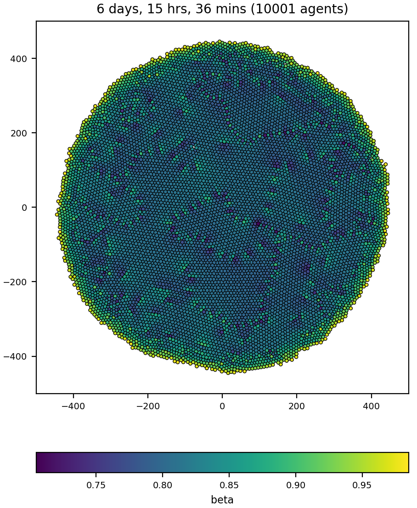

# monolayer
Monolayer OpenVT reference model using PhysiCell

This repository simulates a growing monolayer model as part of the OpenVT project.

## Relaxation of 11 cells

To begin, we model a simple relaxation model of 11 compressed cells in a horizontal line.
```
make -j2
make load PROJ=relaxation_11cells
make
cp project project_11cells     # Windows shell may not have the "cp" command to copy
python ~/git/studio_dev/bin/studio.py -c config/relax_11cells.xml -e project_11cells
project_11cells config/relax_11cells.xml >relax_11cells.out
grep reach relax_11cells.out   # grep probably won't be on a Windows shell
# ---- custom_function: Width reached 90% , t= 88.7
```
Therefore we use 88.7 mins as the PhysiCell time to reach 90% relaxation width, i.e., the leftmost cell is at x= -45 and rightmost at x=45. And 88.7 will become the cell cycle duration for the full monolayer model.

Next, let's plot the results for the relaxation of the 11 compressed cells:
```
python analysis/plot_11cells_crop.py 48
```

<hr>

## Relaxation of 11 + 10 (5 and 5) outer cells

```
make load PROJ=relaxation_21cells
make
project config/relax_21cells.xml
# or:
python <path-to-studio>/bin/studio.py -c config/relax_21cells.xml

# plot relaxation: outer distance = f(time)
python analysis/plot_21cells_crop.py 90
```


Note: 15 hrs in PhysiCell time units = 900 mins. Divide that by the 88.7 min (= 1 T unit; rf. above) to get ~10 T for the x-axis.

<hr>

## Monolayer








