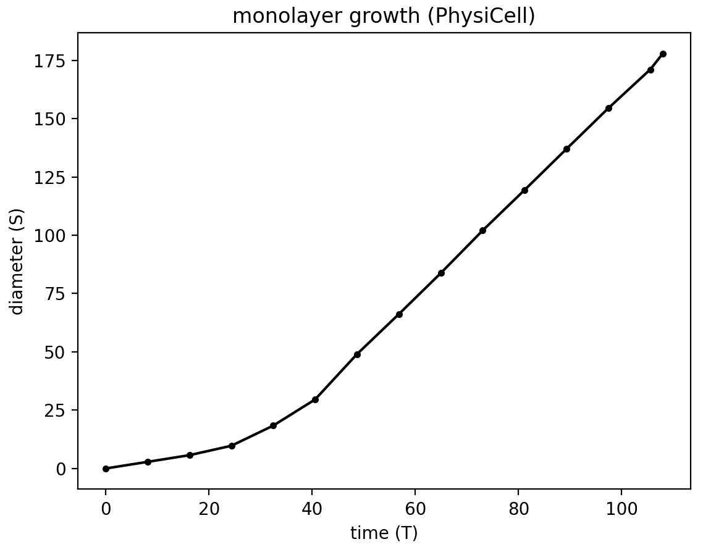

# monolayer
Monolayer OpenVT reference model using PhysiCell

This repository simulates a growing monolayer model as part of the OpenVT project. In the full monolayer model, cells:
* have no adhesion
* have a repulsive force
* divide and grow to a target volume

We use PhysiCell 1.14.2, but with an `/analysis` subdirectory and a modified `Makefile` that copies files from `/analysis` when doing a `make load ...`.

## Relaxation of 11 cells

Before doing the full monolayer model, we begin with a simpler model of 11 compressed cells in a horizontal line and let them mechanically relax. In this model (and the 11+10 model that follows), cells do not divide.


```
make -j2
make load PROJ=relaxation_11cells
make
cp project project_11cells     # Windows shell may not have the "cp" command to copy
python <path-to-studio>/bin/studio.py -c config/relax_11cells.xml -e project_11cells
project_11cells config/relax_11cells.xml >relax_11cells.out
grep reach relax_11cells.out   # grep probably won't be on a Windows shell
# ---- custom_function: Width reached 90% , t= 88.7
```
Therefore we use 88.7 mins as the PhysiCell time to reach 90% relaxation width, i.e., the leftmost cell's center is at x= -45 and rightmost at x=45. And 88.7 will become the cell cycle duration for the full monolayer model.

Next, let's plot the results for the relaxation of the 11 compressed cells:
```
python analysis/plot_11cells_crop.py 48
```
Note that this script will also create a .csv file that we need to upload to https://gitlab.com/rvet/monolayergrowth/-/tree/main/results/PhysiCell/Relaxation (be sure the .csv file has the required header).


<hr>

## Relaxation of 11 + 10 (5 and 5) outer cells


```
make load PROJ=relaxation_21cells
make
project config/relax_21cells.xml
# or:
python <path-to-studio>/bin/studio.py -c config/relax_21cells.xml

# plot relaxation: outer distance = f(time)
python analysis/plot_21cells_crop.py 90
```


Note: 15 hrs in PhysiCell time units = 900 mins. Divide that by the 88.7 min (= 1 T unit; rf. above) to get ~10 T for the x-axis.


## Monolayer - fixed cell cycle

```
python analysis/plot_21cells_inner11_crop.py 100
```


```
python analysis/plot_time_diam.py
```

Using calibrate time (T) and space (S) units.


## Monolayer - stochastic cell cycle


In the following side-by-side images, the left image is from the fixed cell cycle, the right from the non-fixed (stochastic) cell cycle.
<p float="left">
  
  
</p>
<p float="left">
  
  
</p>

<p float="left">
  
  
</p>

<p float="left">
  
  
</p>

<hr>

## Monolayer: $\gamma$, $\beta$ contact inhibition and boundary roughness

|    |$\beta$= 0.5 | 0.8 | 0.9 |
| :------- | :------ | :------ | :------- |
| $\gamma$=0 |  |  |  |
| 0.2 |  |  |  |
| 0.5 |  |  |  |


<hr>

## Monolayer - fixed (flow cyto sep) cell cycle + Bru data

Using a different cell cycle than "live", with an 18 hour fixed cell cycle, and keeping units in PhysiCell mins and microns units, we demonstrate that, for a well chosen value of $\beta$, we can match quite well the experimental data found in Bru.
The cycle model was:
```
                <cycle code="6" name="Flow cytometry model (separated)">
                    <phase_durations units="min">
                        <duration index="0" fixed_duration="true">420</duration>
                        <duration index="1" fixed_duration="true">360</duration>
                        <duration index="2" fixed_duration="true">180</duration>
                        <duration index="3" fixed_duration="true">120</duration>
```
Refer to the [full model](./monolayer_cytomsep_beta.xml) for more details.

<p float="left">
  
  
</p>
The red points are taken from the Bru (or Drasdo?) data:

Relative time (hours) | Total time (hours) | Diameter (um) | Radius (um)
|---|---|---|---|
|0|336|1140|570|
|50 |386 (14 days) |1400|700 |            
|72 |408 (17 d) |1590 |795|
|145|481 (20 d)|2040|1020|
|170|506 (21 d)|2250|1125|
|310|646 (27 d)|3040|1520|


